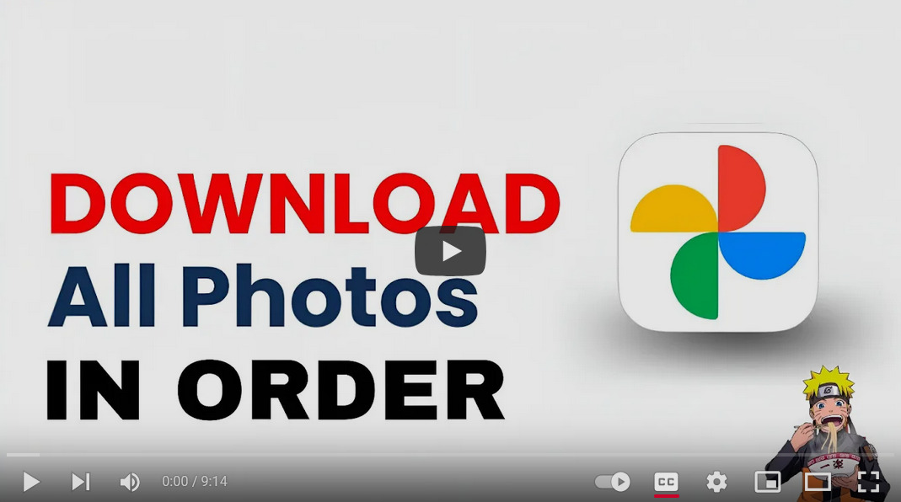

# Google Photos Downloader

Downloads your entire Google Photos library while preserving original quality and file order.
[](https://www.youtube.com/watch?v=QQ49vPLM6nU)
## Key Features
- Downloads all photos and videos from Google Photos
- Organizes files by year and month (2024/January/etc)
- Creates friendly filenames (1st January 2024_time_photo.jpg) 
- Tracks folder statistics (file count, total size)
- Skips existing files automatically
---

## Setting Up Google Photos API Access

### 1. Create a Google Cloud Project
- Go to [Google Cloud Console](https://console.cloud.google.com/).
- Create a new project or select an existing one.

### 2. Enable Google Photos API
- Search **"Enable APIs and Services" >  "+ Enabled APIs and Services+**.
- Search for **"Google Photos Library API"**.
- Click **"Enable"**.


### 3. Configure OAuth Consent Screen
- Go to **"APIs & Services" > "OAuth consent screen"**.
- Select **"External"** user type.
- Enter Required fields
- Fill in the required application information.
- Add the following scopes:
    - `https://www.googleapis.com/auth/photoslibrary`
- Add your Google account as a test user. (gmail in which your photos are stored)

### 4. Create OAuth 2.0 Credentials
- You can follow [Google's guide to set up access](https://support.google.com/googleapi/answer/6158849?hl=en&ref_topic=7013279).
- Go to **"Credentials"**.
- Click **"Create Credentials" > "OAuth client ID"**.
- Choose **"Desktop application"** as the application type.
- Download the client configuration file.

### 5. Setup Project 
- **Rename** the downloaded client configuration file to `secret-token.json` and save it to the project.

### 6. Install Dependencies and Run

- Install the required Python packages:
    ```sh
    pip install -r requirements.txt
    ```
- Run the application:
    ```sh
    python app.py
    ```


 