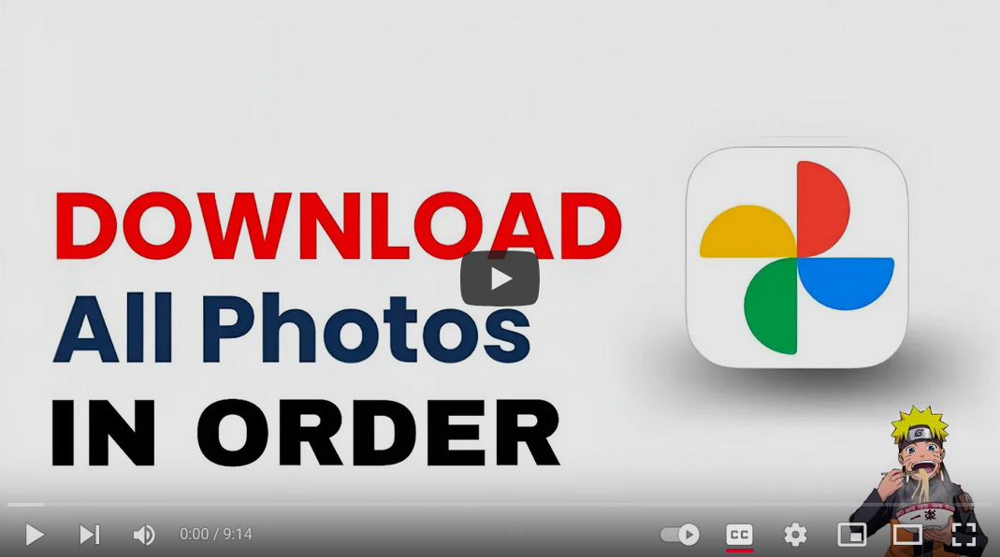

# Google Photos Downloader


Downloads your entire Google Photos library while preserving original metadata, quality and file order using python and the Google Photos API.
The Google Takeout file/folder structure has some interesting inconsistencies/quirks which make it tricky to work with. i created this script for my personal use.
    <br> <br>

<a href="https://www.youtube.com/watch?v=QQ49vPLM6nU" style="margin:1rem;border-radius:1rem;">
    
</a>


## Key Features
- Downloads all photos and videos from Google Photos
- Preserves original metadata (date, location, etc)
- Organizes files by year and month (2024/01_January/etc)
- Creates friendly filenames (1st January 2024_time_photo.jpg) 
- Tracks folder statistics (file count, total size)
- Skips existing files automatically
## Setting Up Google Photos API Access

### 1. Create a Google Cloud Project
- Go to [Google Cloud Console](https://console.cloud.google.com/).
- Create a new project or select an existing one.

### 2. Enable Google Photos API
- Search for **"Enable APIs and Services"**.
- Click on **"+ ENABLE APIS AND SERVICES"**.
- Search for **"Google Photos Library API"**.
- Click **"Enable"**.

### 3. Configure OAuth Consent Screen
- Go to **"APIs & Services" > "OAuth consent screen" > "Clients" > "+Create Client" > "Desktop App" **.
- Select **"External"** user type.
- Enter the required fields.
- Fill in the required application information.
- Go to Data Acesss,
- Add the following scope:
    <br> <br>
  ```
  https://www.googleapis.com/auth/photoslibrary
  ```
- Go to "audience" and scroll down. 
- Add your Google account as a test user (the Gmail account in which your photos are stored).
- Only added accounts will work with the script.

### 4. Create OAuth 2.0 Credentials
- Follow [Google's guide to set up access ](https://support.google.com/cloud/answer/15549257?sjid=11046833352039128239-NC#zippy=%2Cnative-applications-android-ios-desktop-uwp-chrome-extensions-tv-and-limited-input).
- Go to **"Credentials"**.
- Click **"Create Credentials" > "OAuth client ID"**.
- Choose **"Desktop application"** as the application type.
- Download the client configuration file.
- **Rename** the downloaded client configuration file to `secret-token.json` and save it to the project directory.

### 6. Install Dependencies and Run

* If Python is not installed, download and install it from [python.org](https://www.python.org/downloads/).
* Run the following commands in your terminal. The inline comments explain what each step does:

```sh
# Create a virtual environment (run this only once)
python -m venv venv

# Activate the virtual environment
# On Windows:
venv\Scripts\activate
# On Linux/macOS:
source venv/bin/activate

# Install the required dependencies
pip install -r requirements.txt

# Run the application
python app.py
# Thank you for using my app. Pls give feedback.
```
- log in to your Google account, click continue and start downloading your Google Photos.

- If you want to transfer it to another account
You will lose some metadata, but you will be able to transfer all your photos and videos to another account.

- Run the application:
    <br> <br>
    ```sh
    python upload_to_another_acc.py
    ```


## Disclaimer

This tool was only written for the purpose of solving my own personal requirements.

I decided to make this public on GitHub because:

- It was useful for me, so maybe it'll be useful for others in the future.
- Future me might be thankful if I ever need to do this again.

With that said, please bear in mind that this tool won't be actively maintained and your mileage may vary. I'm sure it's far from perfect so if you choose to use it please proceed with caution and be careful to verify the results! I hope it's helpful.
